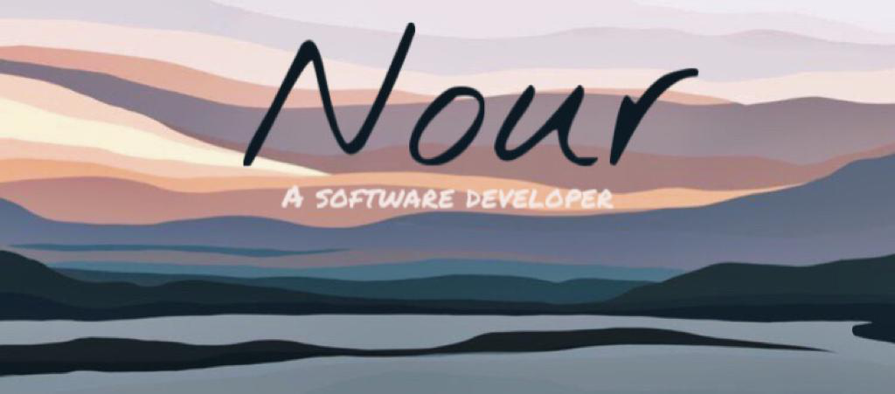

 

<h2> about me</h2>

hey im nour   a self-taught front-end developer lorem ipsum dolor sit amet, consectetur adipiscing elit. Aliquam consequat aliquam dui tincidunt mattis. Fusce finibus semper dui, ut efficitur nunc fermentum eget. Morbi ultricies tellus nec purus eleifend tincidunt. Vivamus porta porta porta. Fusce sodales 

<h2 align="left"> Projects:</h2>

  <table>
      <tr>
        <td width="50%">
          <h3 align="center">Space Toursism</h3>
          

            
              
            

              how about a trip to the outer space !
            

          

        </td>
        <td width="50%">
          <h3 align="center">Quizzical</h3>
          

            
               
            

              how much do you know ?
            

          

        </td>
      </tr>
      <tr>
        <td width="50%">
          <h3 align="center">Meme Generator</h3>
          

            
              
            

              100 images of the most popular memes 
            

          

        </td>
       <td width="50%">
          <h3 align="center">Tenzies Game</h3>
          

            
              
            

              roll the dice to win the tenzies
            

          

        </td>
      </tr>
  </table>

 

 
 
<h2 align="center">lets connect</h2>

